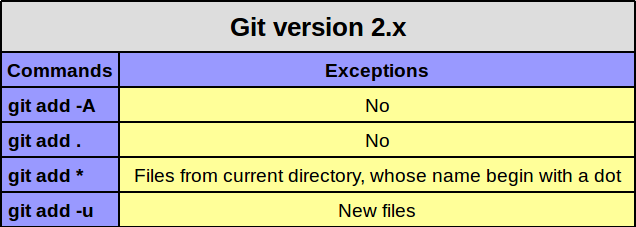

# Basic Commands

## Resources

- [How to Write a Git Commit Message](https://chris.beams.io/posts/git-commit/)
- [How to use GitHub like a proper human being](https://stories.devacademy.la/how-to-use-github-like-a-proper-human-being-1a9c895c4e13) 

## Create a new repo

1. Create a new folder:

```
$ mkdir my-repo
$ cd my-repo # change directory
```

2. Init a new repository:

```
$ git init
```

## Simple commit

1. Create a new file

```
$  echo "Hi world" > new.txt
```

2.  See your status, new.txt is untracked

```
$ git status
```

3. Stage the new file

```
$ git add new.txt
```

4. git status, new.txt is "to be committed"

```
$ git status
```

5. Add commit

```
$ git commit -m "Add new.txt"
```

8. See the history

```
$ git log
```

## Extra Notes

1. You can combine the `git add` command with `git commit` of this way:

```
$ git commit -am "Some change"
```

2. Multiple ways to add changes to git



## You turn

Create a repository and add your first commit.
