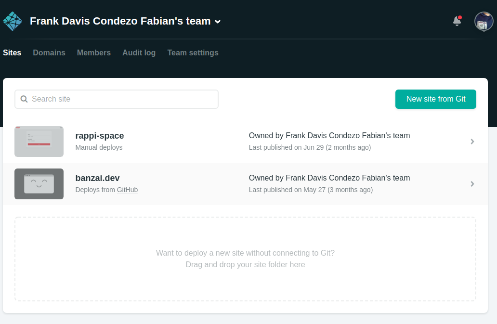
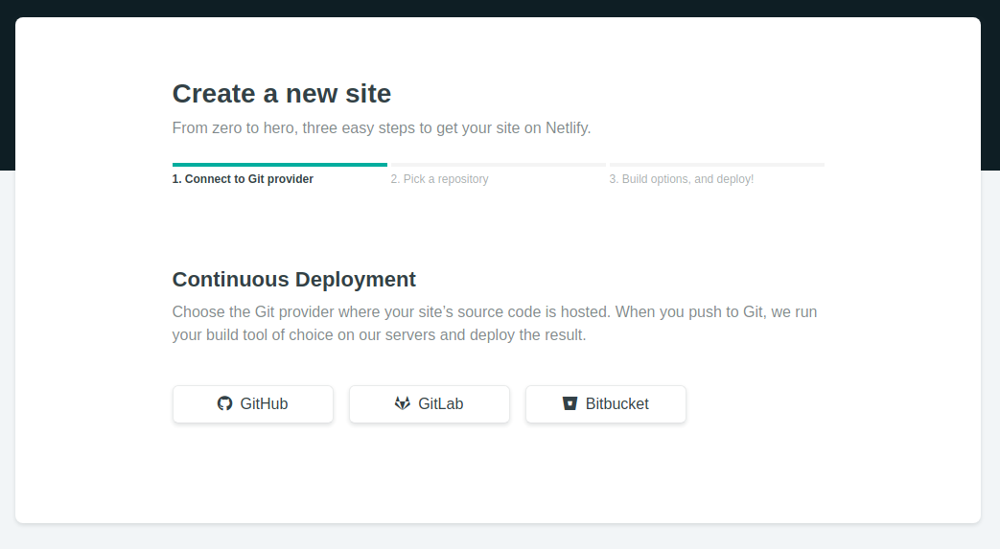
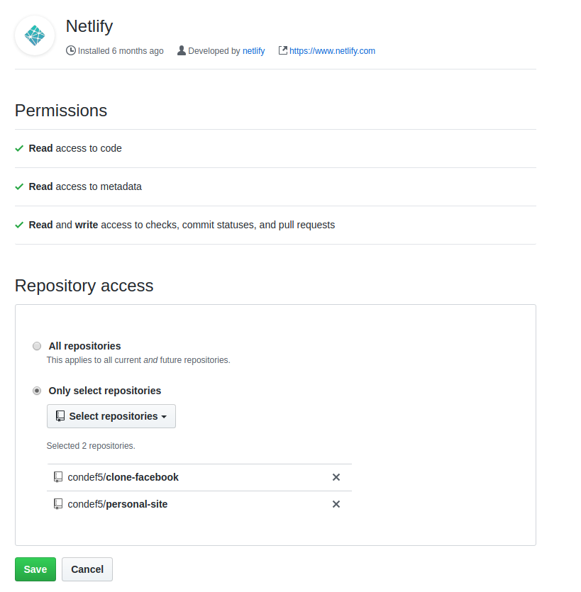
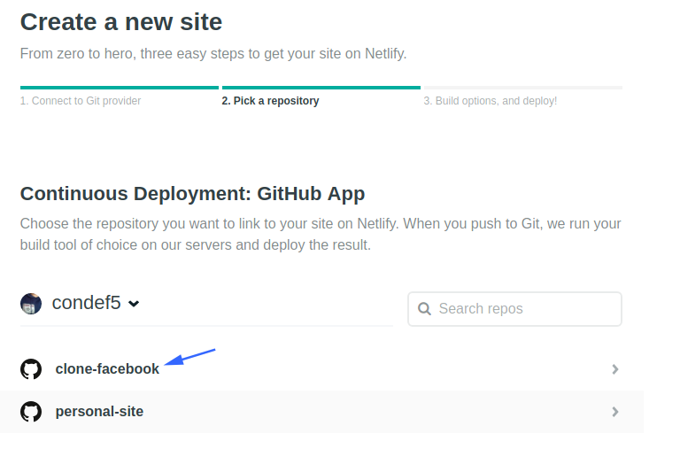
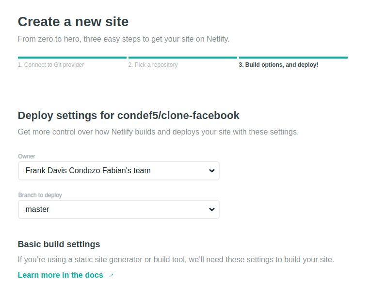
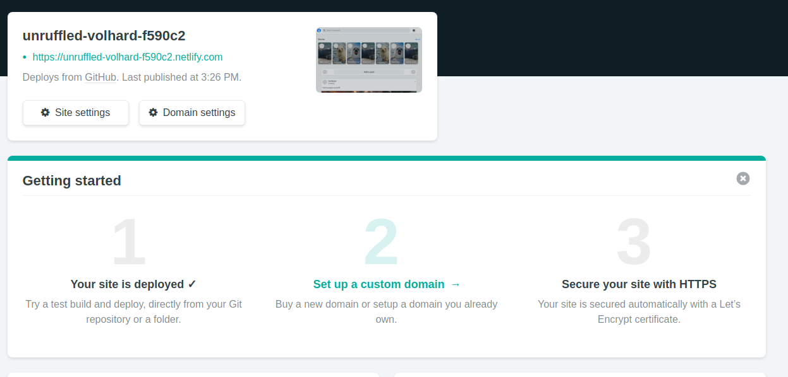

# Automatic deployment

Create account in [netlify](https://www.netlify.com/)

1. New site in netlify

2. Choose provider

3. Choose repo from github

4. The next step in selected repository

5. Choose the branch and create site

6. Deployment successfull

## Resources

- [Now for github](https://zeit.co/github)
- [Heroku Integration](https://devcenter.heroku.com/articles/github-integration)
- [A Step-by-Step Guide: Deploying on Netlify](https://www.netlify.com/blog/2016/09/29/a-step-by-step-guide-deploying-on-netlify/)
- [The Beginner’s Guide to Netlify ](https://hackernoon.com/netlify-continuous-deployment-github-react-lambdaschool-67f3ae658d31)

## You turn

1. Clone this [repository](https://github.com/condef5/clone-facebook).
2. Change the title and add the commit.
3. Create a new repository from your github account.
4. Add new remote(your link repository) and push changes.
5. Deploy repo in netlify.
